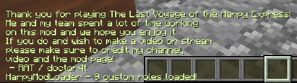

# HarpyModLoader

Modded role loader for the Harpy Express. 

## For players:

Start games with the horn, autostart or `/tmm:start harpymodloader:modded` to start a game with modded roles.

## For modders:

***Custom mods should use TMMRoles.registerRole() to add roles, then let this mod handle role assignment from there.***

This mod is **not** required be imported into any mod! Importing the mod into your project is only nessecary if wanting to add items when a player spawns.

## What does the mod do?

The mod makes it so roles added to TMMRoles.ROLES automatically have a RoleAnnouncement and are given to players. `canUseKillerFeatures()` will decide if the role is given to killers or civillians.

This mod also contains some client-side QOL features to make roles easier to see in spectator, with colored instinct glow and a role name-tag.

### Run code when role is assigned

To run code once a role is assigned, use the `ModdedRoleAssigned` event.

This library does not have a Maven, so you will have to manually add it through a `files()` call in your `build.gradle`.

Also makes this text rainbow and gives a role counter. Woohoo!